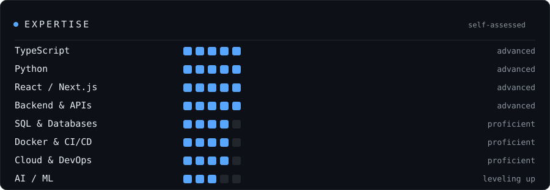
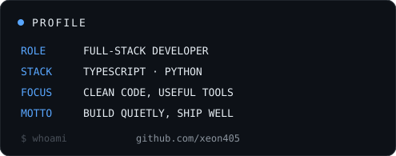
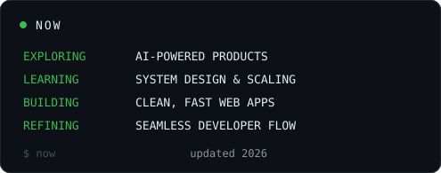
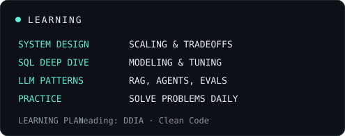
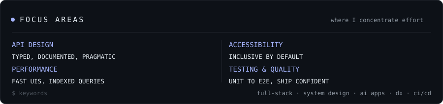
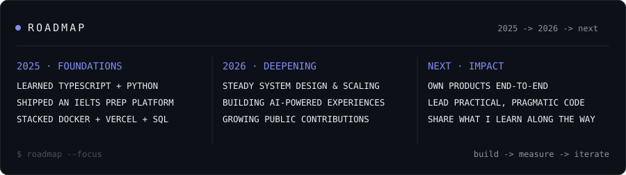

  

  

  
  
  

## About

Full-stack developer focused on building **clean, scalable, and reliable products** — shipped
end-to-end. I care about engineering quality and intentional design, and I take ownership of
everything from a polished TypeScript frontend to the Python service, database, and CI/CD behind it.

- Full-stack ownership — design to deployment, frontend to database
- Modern, typed code — TypeScript frontend, Python services, clean SQL
- Product-minded — build with users in mind, iterate from real feedback
- Own the shipping process — Docker, GitHub Actions, Vercel
- Always leveling up — system design, scaling patterns, and AI integrations

## Experience & Skills

  

## Tech Stack

| Frontend | Backend | Data |
| --- | --- | --- |
|           |          |         |

| Languages | AI & ML | Cloud & DevOps |
| --- | --- | --- |
|        |          |           |

| Testing | Tools |
| --- | --- |
|      |          |

## GitHub

  
  

## Currently

  
  

## Focus Areas

  

## Roadmap

  

## Get in Touch

I'm always interested in great products, interesting problems, and strong teams. Open to
**full-time** and **freelance** opportunities.

  
  
  
  
  
  

  
  
  

