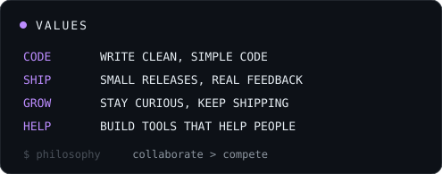

  

  

  
  
  

**Full Stack Developer focused on building clean, scalable, and reliable products.** I care about
engineering quality and intentional design — shipping end-to-end, from polished TypeScript frontends
to dependable Python services, databases, and CI/CD.

  
  

  

  
  

  

  

  

  

  

  

  

  

  <code>$ echo "thanks for stopping by — let's build something good together"</code>

