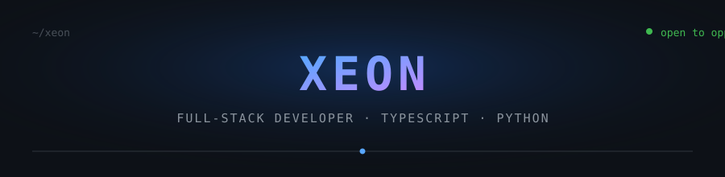

  

## About

Full-stack developer specializing in **TypeScript, Python, and PostgreSQL**. I build fast,
dependable products end-to-end — from API design and typed frontends to database modeling,
deployments, and CI/CD. I write clean, tested, maintainable code and take ownership of outcomes.

## Core Competencies

- **Full-stack engineering** — frontend, backend, and data layers
- **API design** — typed `REST` and `GraphQL`, proper error handling and documentation
- **Reliable shipping** — Docker, CI/CD pipelines, and cloud deployments
- **Quality by default** — unit to end-to-end testing, linting, performance, accessibility
- **AI-assisted products** — LLM integrations, retrieval, and evaluation patterns

## Technical Skills

**Languages** &nbsp; TypeScript · Python · JavaScript · Go · SQL · C · Bash

**Frontend** &nbsp; React · Next.js · Tailwind CSS · Redux · Vite

**Backend** &nbsp; Node.js · Express · FastAPI · Django · GraphQL · WebSockets

**Data** &nbsp; PostgreSQL · MySQL · MongoDB · Redis · SQLite · Prisma · Supabase

**AI / ML** &nbsp; OpenAI · LangChain · PyTorch · scikit-learn · NumPy · Pandas

**DevOps** &nbsp; Docker · Kubernetes · Nginx · GitHub Actions · AWS · Vercel · Linux

## How I Work

- **Own the full cycle** — from problem definition and design to deployment and monitoring
- **Communicate in plain language** — document decisions, tradeoffs, and open questions
- **Ship small, measured increments** — then iterate on real feedback
- **Review as a student, not a judge** — mentor, share knowledge, and keep everyone unblocked

## What I'm Looking For

I'm working toward senior-level engineering by shipping real products with strong teams:

- A team that values **quality, mentorship, and honest feedback**
- Opportunities to **lead features and own architecture decisions**
- Product work with **measurable impact** — users, performance, and revenue
- Remote-first culture with clear ownership and trust

## Currently Learning

- System design and scaling patterns
- SQL modeling, indexing, and query optimization
- LLM application engineering — retrieval, agents, and evaluation
- Clear, concise technical writing and documentation

## GitHub Activity

  

## Contact

Open to **full-time** and **freelance** opportunities — remote-first. Replies within 24 hours.

  
  
  

